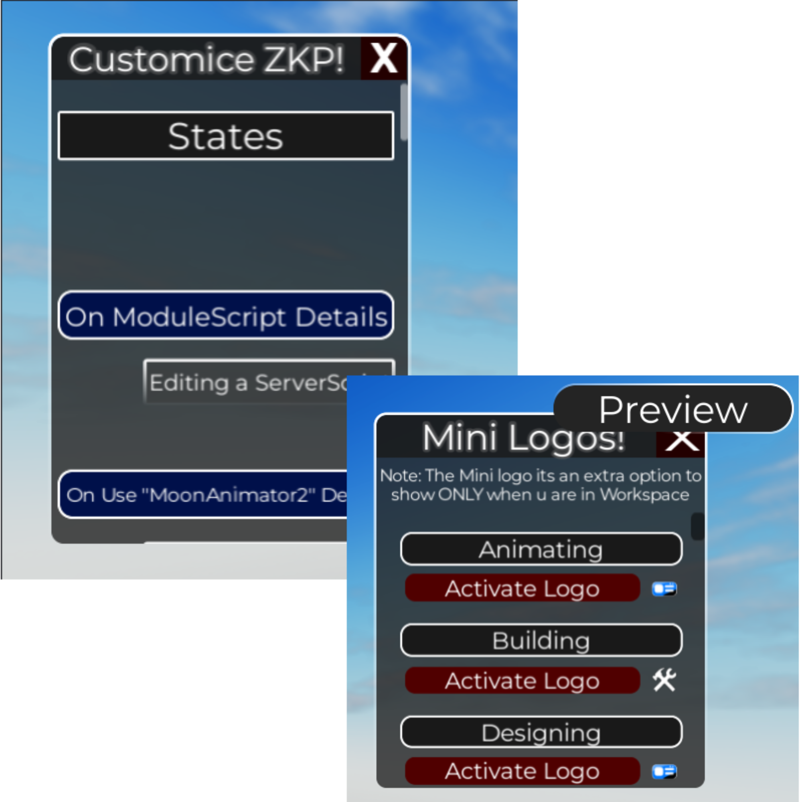
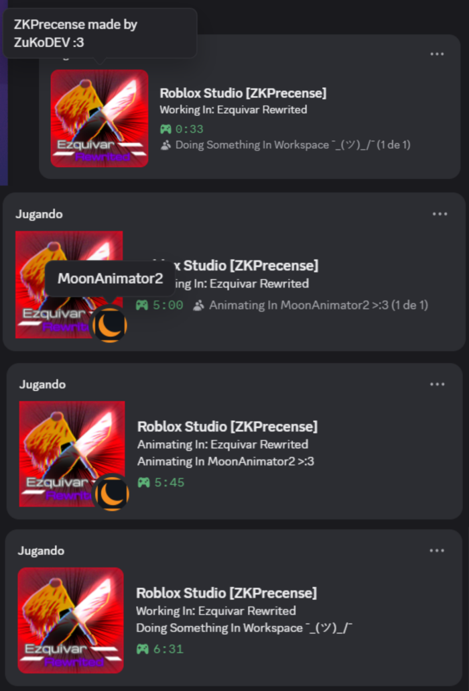
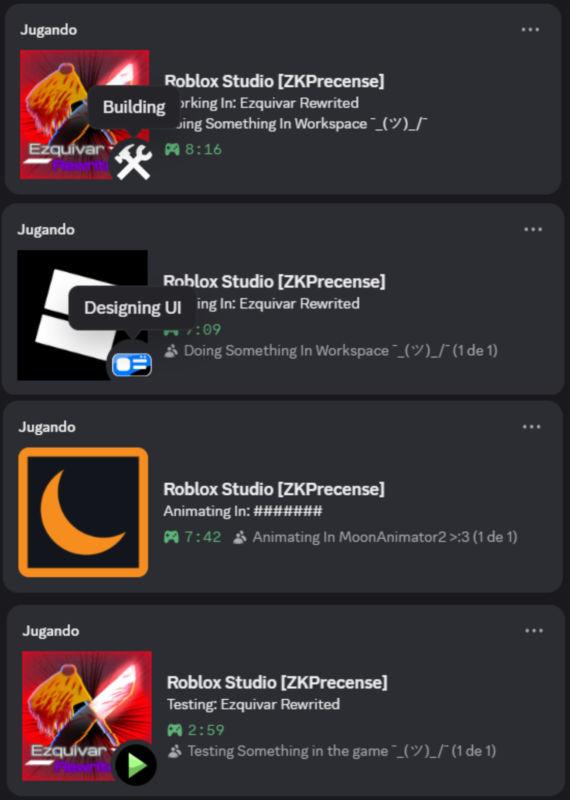
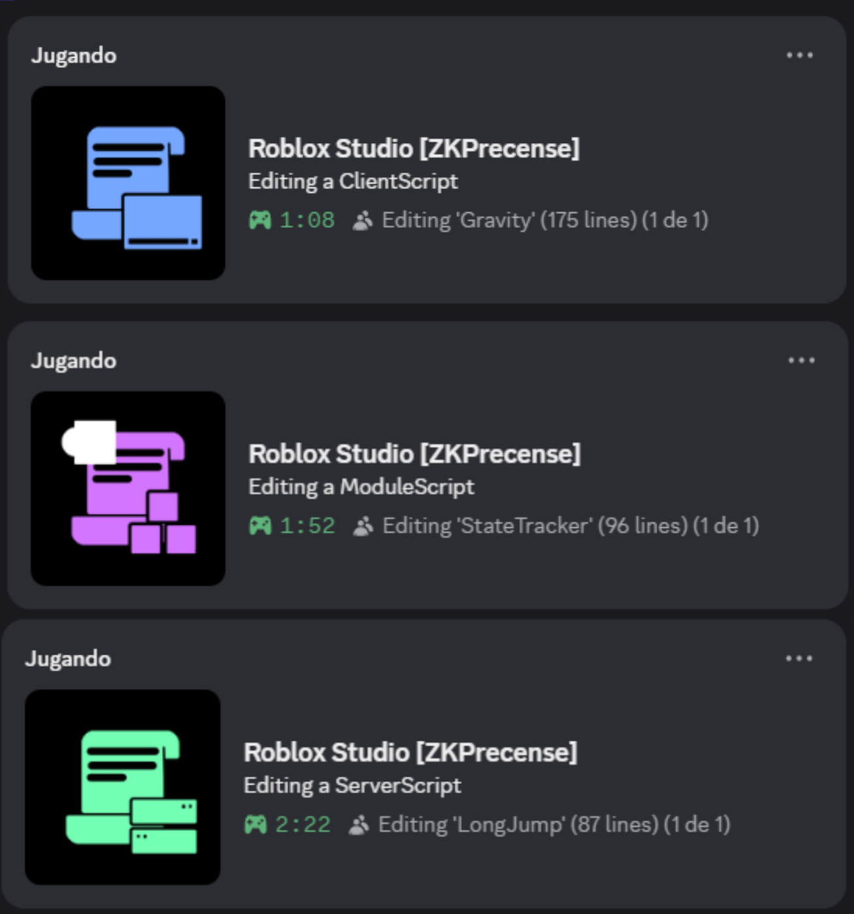
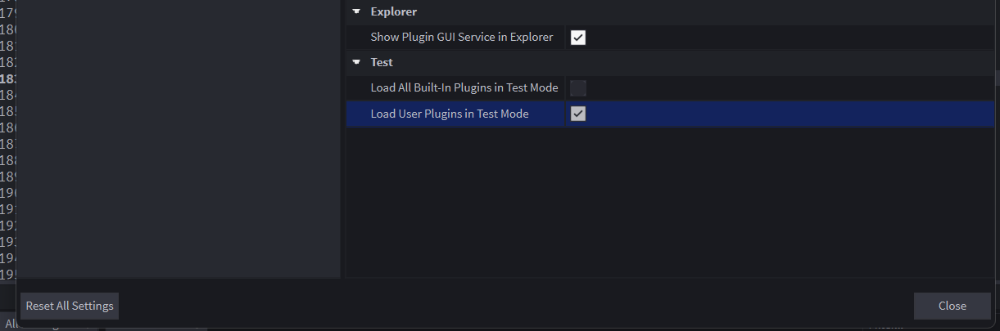
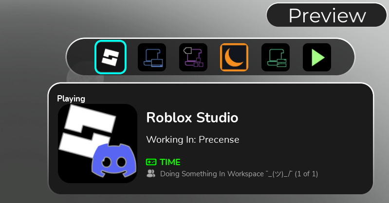

# ZKPrecense made by ZuKoDEV!

### Customization Inside Studio!

### Special States!

### Scripts States!

# Instalation
Its sooo easy to use this just do you need

- Download the server [Here](https://github.com/ZuKomaDEVYT/ZKPrecense/releases/latest) and then extract in any folder and execute the .exe file (Discord need be open first to work obiously)

- Download the [RobloxPlugin](https://create.roblox.com/store/asset/124059053967595)

# IMPORTANT
You need to enable **Load User Plugins in Test Mode** for **Testing State** work properly

## What is ZKPrecense
**ZKPresence** is a plugin developed by me **ZuKoDEV**, This plugin allows you to connect **RobloxStudio with Discord**, allowing you to show what you're working on, the game's visuals, how many collaborators you have, and let people try out your experience, among many other things.

But of course, if there are already several plugins that do this, why use **ZKPresence**? This is because this plugin allows you to do many things that other plugins offer separately... CUSTOMIZATION

You can customize everything, such as:
- The description when you are in a ModuleScript, Script, LocalScript, in the workspace, or, what I like most, ANIMATING
- Whether or not to show the collaborators who are with you in the experience
- Activate the "Play My Game" button, which allows those who view your RPC to try your experience
- Add an extra button for whatever you want (I'm not responsible for what they put :3)
- Make the game image appear instead of the RobloxStudio image
- Add a Sub State when you are in the workspace
- Disable the plugin independently in case you have multiple RobloxStudios at the same time
- Show or not the game image
- And the most useless thing is to move the customization window (sometimes it doesn't work, and don't even ask me why :'<)

## API?
ZKPrecense has a special API that allows other plugins work with it you can see how use the API [Here](https://devforum.roblox.com/t/4433265)

## Extra detais in ZKP
- A button to preview Presence without waiting for it to update on Discord

- Detection of multiple Studio sessions

### Special thanks to
[Rigid Studios](https://devforum.roblox.com/u/Rigid_Studios) - The first studio to make a RPC in roblox
[iArxic](https://github.com/iArxic/StudioPresence) - ZKPrecense has been inspired from StudioPrecense by iArxic

If you want to modify the source code, it can be modified in: https://github.com/ZuKomaDEVYT/ZKPrecense

If u have problems or a sugestion just comment in the [Roblox DEV Forum](https://devforum.roblox.com/t/3822916)
